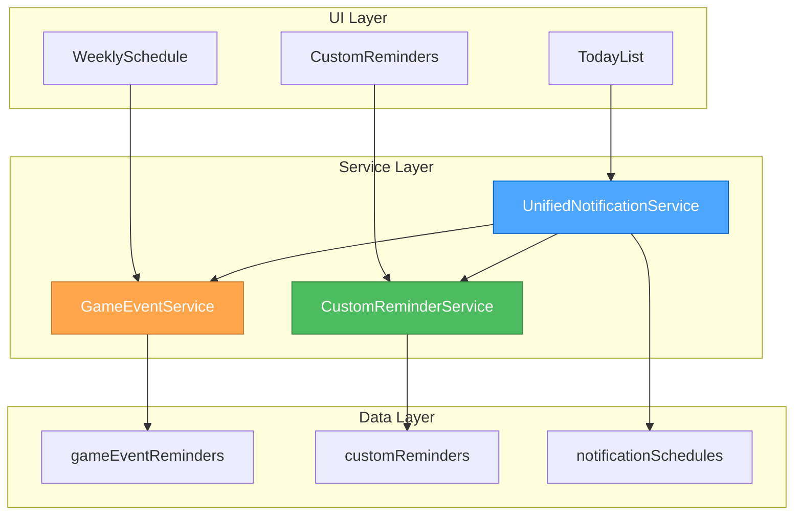
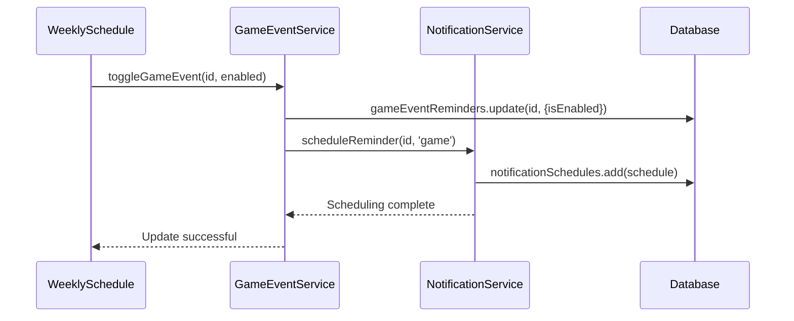

# 🎨🎨🎨 ENTERING CREATIVE PHASE: ARCHITECTURE DESIGN 🎨🎨🎨

**Component**: Dual Data Model Architecture for Game Events + Custom Reminders  
**Date**: February 2, 2025  
**Complexity**: Level 3 Intermediate Feature

## PROBLEM STATEMENT

**Challenge**: Design a database and service architecture that seamlessly integrates game events with existing custom reminders while maintaining data integrity, performance, and clear separation of concerns.

**System Requirements**:

- Support 963 predefined game events from JSON schedule
- Maintain existing custom reminder functionality
- Unified notification service for both reminder types
- Database migration from existing schema without data loss
- Type-safe TypeScript interfaces throughout
- Shared UI components where possible

**Technical Constraints**:

- Must preserve existing reminder data during migration
- IndexedDB with Dexie.js as storage layer (existing)
- Notification service must handle dual scheduling logic
- Performance: <500ms query time for schedule operations
- Bundle size: maintain <500KB total application size

## ARCHITECTURE REQUIREMENTS ANALYSIS

**Core Components Requiring Architecture**:

1. **Data Models**: GameEventReminder vs CustomReminder distinction
2. **Database Schema**: Version migration strategy with dual tables
3. **Service Layer**: Enhanced notification service with type discrimination
4. **Repository Pattern**: Unified data access layer
5. **UI Integration**: Shared components for different reminder types

**Non-Functional Requirements**:

- **Scalability**: Support for additional game event types in future
- **Maintainability**: Clear separation between game logic and custom logic
- **Performance**: Efficient queries for time-based event lookups
- **Type Safety**: Comprehensive TypeScript coverage
- **Migration Safety**: Zero data loss during database upgrades

## 🎨 CREATIVE CHECKPOINT: Architecture Research

**Comparable Architecture Patterns**:

1. **Event Sourcing**: Separate event streams for different domains
2. **Multi-tenant Data Models**: Shared schema with type discrimination
3. **Strategy Pattern**: Different notification strategies per reminder type
4. **Repository Pattern**: Unified interface for data access
5. **Database Migration Patterns**: Version-based schema evolution

## ARCHITECTURE OPTIONS ANALYSIS

### Option 1: Single Table with Type Discrimination

**Description**: Store both game events and custom reminders in one table with a `type` field

**Schema Structure**:

```typescript
interface UnifiedReminder {
  id: string;
  type: "game" | "custom";
  title: string;
  time: string;
  // Game event specific fields (nullable for custom)
  utc_time?: string;
  dayOfWeek?: number;
  color?: string;
  // Custom reminder specific fields (nullable for game)
  date?: string;
  recurrence?: "once" | "daily" | "weekly" | "hourly";
  isActive: boolean;
  notificationEnabled: boolean;
}
```

**Pros**:

- Simple database schema with single table
- Unified CRUD operations
- Easy to query across both types
- Simplified migration (just add fields)

**Cons**:

- Nullable fields create complex validation logic
- Type safety compromised with optional fields
- Business logic mixing between domains
- Schema pollution with unused fields per type

**Technical Fit**: Medium
**Complexity**: Low
**Scalability**: Low (becomes unwieldy with more event types)
**Maintainability**: Poor

---

### Option 2: Separate Tables with Shared Interfaces (RECOMMENDED)

**Description**: Dedicated tables for game events and custom reminders with unified service layer

**Schema Structure**:

```typescript
// Separate tables
interface GameEventReminder {
  id: string;
  utc_time: string;
  dayOfWeek: number;
  title: string;
  description: string;
  color: string;
  isEnabled: boolean;
  isWeeklyRecurring: boolean;
  createdAt: Date;
  updatedAt: Date;
}

interface CustomReminder {
  id: string;
  title: string;
  description?: string;
  time: string;
  date?: string;
  recurrence: "once" | "daily" | "weekly" | "hourly";
  isActive: boolean;
  notificationEnabled: boolean;
  createdAt: Date;
  updatedAt: Date;
  category?: string;
}

// Unified notification scheduling
interface NotificationSchedule {
  id: string;
  reminderId: string;
  reminderType: "game" | "custom";
  scheduledTime: Date;
  title: string;
  body: string;
  isProcessed: boolean;
  createdAt: Date;
}
```

**Service Layer**:

```typescript
abstract class BaseReminderService<T> {
  abstract create(reminder: T): Promise<string>;
  abstract update(id: string, updates: Partial<T>): Promise<void>;
  abstract delete(id: string): Promise<void>;
}

class GameEventService extends BaseReminderService<GameEventReminder> {}
class CustomReminderService extends BaseReminderService<CustomReminder> {}
class UnifiedNotificationService {} // Handles both types
```

**Pros**:

- Clean separation of concerns by domain
- Type-safe interfaces for each reminder type
- Independent evolution of game vs custom logic
- Clear data model boundaries
- Optimized queries per table
- Easy to test and maintain

**Cons**:

- More complex database schema (3 tables vs 1)
- Requires unified service layer for notifications
- Slightly more code for dual service management

**Technical Fit**: High
**Complexity**: Medium
**Scalability**: High (easy to add new event types)
**Maintainability**: Excellent

---

### Option 3: Event-Driven Architecture with CQRS

**Description**: Command/Query separation with event sourcing for complex business logic

**Pros**:

- Ultimate scalability and flexibility
- Clear audit trail of changes
- Complex business logic support

**Cons**:

- Massive overkill for current requirements
- Complex to implement and maintain
- Poor fit for client-side IndexedDB

**Technical Fit**: Low
**Complexity**: Very High
**Scalability**: Excellent (but unnecessary)
**Maintainability**: Complex

## DECISION & RATIONALE

**Selected Architecture**: **Option 2 - Separate Tables with Shared Interfaces**

**Rationale**:

1. **Domain Separation**: Game events and custom reminders are fundamentally different domains with different behaviors
2. **Type Safety**: Separate interfaces provide compile-time safety and better IDE support
3. **Independent Evolution**: Game event features can evolve without affecting custom reminder logic
4. **Performance**: Dedicated tables allow for optimized indexes and queries
5. **Maintainability**: Clear boundaries make testing and debugging easier
6. **Migration Path**: Can migrate existing custom reminders to new table structure cleanly

## DETAILED ARCHITECTURE DESIGN

### Database Schema (IndexedDB v2)

```typescript
export class AntsCalcDatabase extends Dexie {
  gameEventReminders!: Table<GameEventReminder>;
  customReminders!: Table<CustomReminder>;
  notificationSchedules!: Table<NotificationSchedule>;
  appSettings!: Table<AppSettings>;

  constructor() {
    super("AntsCalcDatabase");

    // Version 2 - New schema with separate tables
    this.version(2)
      .stores({
        gameEventReminders:
          "id, utc_time, dayOfWeek, isEnabled, isWeeklyRecurring",
        customReminders:
          "id, time, date, recurrence, isActive, notificationEnabled, category",
        notificationSchedules:
          "id, reminderId, reminderType, scheduledTime, isProcessed",
        appSettings:
          "id, notificationsEnabled, notificationPermission, timeZone",
      })
      .upgrade((trans) => {
        // Migration logic from v1 to v2
        return this.migrateFromLegacyReminders(trans);
      });
  }
}
```

### Service Layer Architecture



### Migration Strategy

```typescript
class DatabaseMigration {
  async migrateFromLegacyReminders(transaction: Transaction) {
    // 1. Read existing reminders from v1 schema
    const legacyReminders = await transaction.table("reminders").toArray();

    // 2. Transform to new CustomReminder format
    const customReminders = legacyReminders.map((legacy) => ({
      ...legacy,
      recurrence: legacy.isDaily ? "daily" : "once",
      // Map other fields as needed
    }));

    // 3. Insert into new customReminders table
    await transaction.table("customReminders").bulkAdd(customReminders);

    // 4. Initialize game events from JSON
    await this.initializeGameEventsFromSchedule(transaction);

    // 5. Migrate notification schedules
    await this.migrateNotificationSchedules(transaction);
  }
}
```

### Unified Notification Service

```typescript
class UnifiedNotificationService {
  async scheduleReminder(id: string, type: "game" | "custom"): Promise<void> {
    const reminder =
      type === "game"
        ? await this.gameEventService.getById(id)
        : await this.customReminderService.getById(id);

    const scheduledTime = this.calculateNextNotificationTime(reminder, type);

    await this.scheduleNotification({
      reminderId: id,
      reminderType: type,
      scheduledTime,
      title: reminder.title,
      body: this.generateNotificationBody(reminder, type),
    });
  }

  private calculateNextNotificationTime(
    reminder: GameEventReminder | CustomReminder,
    type: "game" | "custom"
  ): Date {
    return type === "game"
      ? this.calculateGameEventTime(reminder as GameEventReminder)
      : this.calculateCustomReminderTime(reminder as CustomReminder);
  }
}
```

### Repository Pattern Implementation

```typescript
interface ReminderRepository<T> {
  findById(id: string): Promise<T | undefined>;
  findAll(): Promise<T[]>;
  create(reminder: Omit<T, "id" | "createdAt" | "updatedAt">): Promise<string>;
  update(id: string, updates: Partial<T>): Promise<void>;
  delete(id: string): Promise<void>;
}

class GameEventRepository implements ReminderRepository<GameEventReminder> {
  async findByTimeAndDay(
    time: string,
    dayOfWeek: number
  ): Promise<GameEventReminder[]> {
    return db.gameEventReminders.where({ utc_time: time, dayOfWeek }).toArray();
  }
}
```

## COMPONENT INTERACTION FLOW



## VALIDATION AGAINST REQUIREMENTS

✅ **Support 963 game events**: Dedicated gameEventReminders table with efficient lookups  
✅ **Maintain custom reminders**: Preserved in separate customReminders table  
✅ **Unified notifications**: Single NotificationService handles both types  
✅ **Database migration**: Version 2 upgrade with data preservation  
✅ **Type safety**: Separate TypeScript interfaces for each domain  
✅ **Performance**: Optimized indexes and queries per table  
✅ **Scalability**: Easy to add new event types or reminder features

## IMPLEMENTATION CONSIDERATIONS

**Database Indexes**:

- Game events: `(utc_time, dayOfWeek)` composite index for schedule lookups
- Custom reminders: `(time, date)` composite index for time-based queries
- Notifications: `(scheduledTime, isProcessed)` for cleanup operations

**Error Handling**:

- Migration failures: Rollback mechanism with data backup
- Service failures: Graceful degradation with offline support
- Type validation: Runtime checks for data integrity

**Performance Optimizations**:

- Lazy loading: Load only visible time slots initially
- Caching: In-memory cache for frequently accessed game events
- Batch operations: Bulk enable/disable for multiple events

## RISK ASSESSMENT

**High Risk**:

- Migration complexity: Mitigation with comprehensive testing and rollback
- Performance with 963 events: Mitigation with virtual scrolling and pagination

**Medium Risk**:

- Type system complexity: Mitigation with thorough TypeScript definitions
- Service coordination: Mitigation with clear interface contracts

**Low Risk**:

- UI integration: Well-established patterns with existing components

🎨🎨🎨 EXITING CREATIVE PHASE - ARCHITECTURE DECISION MADE 🎨🎨🎨

**Architecture Decision**: Separate tables for game events and custom reminders with unified notification service layer, leveraging repository pattern and type-safe service abstractions.
